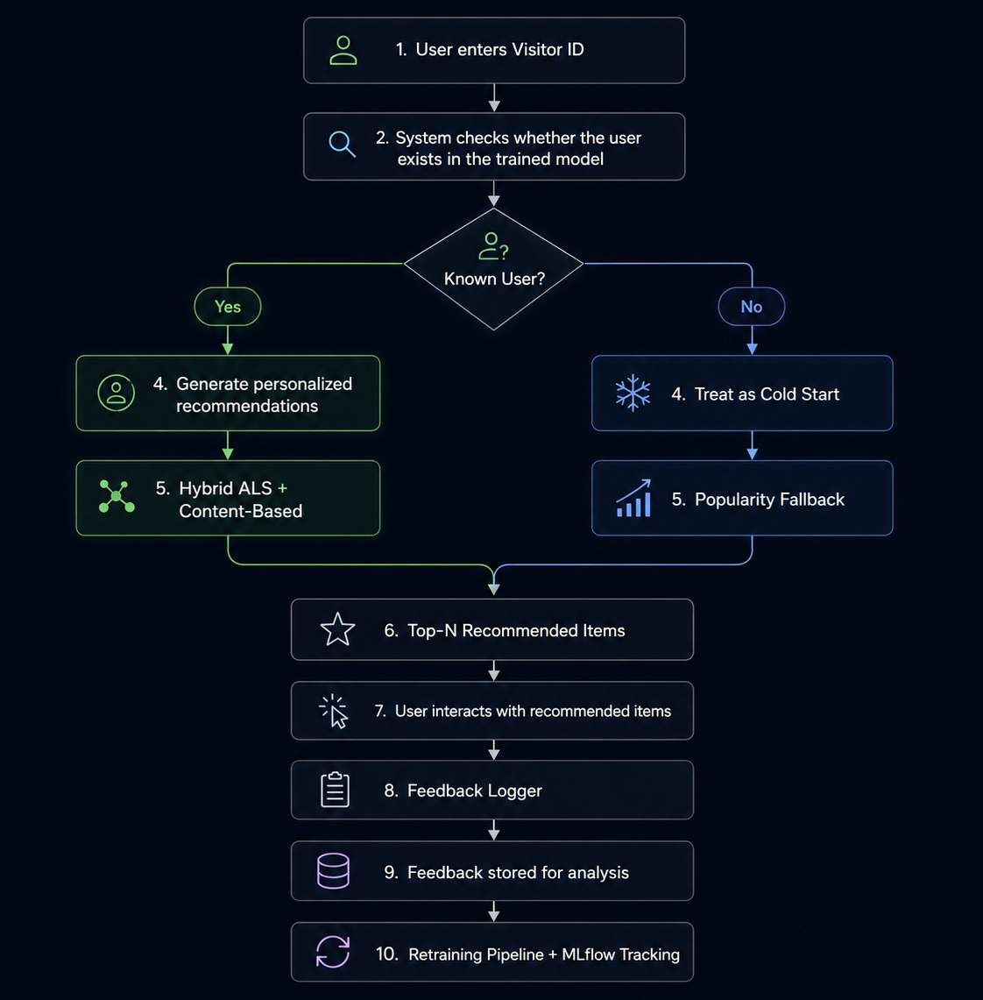

# Personalized Recommendation System with Feedback Loop

## Project Overview

This project is an end-to-end personalized recommendation system built using a Retailrocket-style e-commerce dataset.

The system recommends relevant items to users based on implicit feedback such as product views, add-to-cart actions, and transactions. The project includes data preprocessing, feature engineering, model training, model evaluation, hybrid recommendation logic, feedback logging, a retraining workflow concept, MLflow tracking, and a local Streamlit demo.

## Dataset

The project uses a Retailrocket-style e-commerce dataset that includes:

* User-item interaction events
* Event types: `view`, `addtocart`, and `transaction`
* Item properties
* Timestamps

Since the dataset uses anonymized product identifiers, the demo displays recommended **item IDs** instead of real product names or product images.

Raw and processed data files are not included in this repository because they are generated files and may be large.

## System Flow

The following diagram shows how the recommendation system works:



## How the System Works

The system handles two main user cases:

### Known Users

If the user already exists in the training data, the system generates personalized recommendations using a **Hybrid ALS + Content-Based** recommender.

### Cold-Start Users

If the user is new and has no historical interactions, the system uses a **Popularity Fallback** strategy.

After recommendations are generated, user interactions can be logged and later used by the retraining workflow.

## Main Pipeline

The project pipeline includes:

1. Loading interaction and item property data
2. Removing duplicate events
3. Converting timestamps
4. Creating implicit interaction strength
5. Applying recency weighting
6. Filtering noisy users and rare items
7. Creating chronological train, validation, and test splits
8. Building a sparse user-item interaction matrix
9. Creating item content features using TF-IDF
10. Training multiple recommendation models
11. Evaluating models using ranking metrics
12. Selecting the final hybrid recommender
13. Logging user feedback
14. Supporting a retraining workflow
15. Running a local Streamlit demo

## Models Implemented

The following recommendation approaches were implemented and compared:

* Popularity Baseline
* ALS Collaborative Filtering
* BPR
* Content-Based Recommendation
* Hybrid ALS + Content-Based Recommendation

## Final Model

The final selected model is a **Hybrid ALS + Content-Based Recommender**.

The hybrid model combines:

* Collaborative filtering signals from ALS
* Item similarity signals from content-based features
* Weighted rank fusion for final ranking

Final hybrid configuration:

* ALS weight: `0.7`
* Content-based weight: `0.3`
* Candidate generation size: `100`
* Cold-start strategy: `Popularity Fallback`

## Evaluation Metrics

The models were evaluated using Top-K ranking metrics:

* Precision@K
* Recall@K
* MAP@K
* NDCG@K
* Coverage@K

`NDCG@10` was used as the primary ranking metric because it considers both recommendation relevance and item position in the ranked list.

## Project Structure

```text
.
├── how_recommendation_systems_work_flowchart.png
├── notebooks/
│   ├── Milestone_1.ipynb
│   └── milestone_2.ipynb
├── reports/
│   ├── final_data_quality_leakage_report.json
│   ├── milestone_1_summary.json
│   ├── mlflow_clean_summary.json
│   ├── mlflow_run_summary.json
│   └── retraining_strategy.md
├── src/
│   ├── feedback_logger.py
│   ├── mlflow_tracking.py
│   ├── retraining_pipeline.py
│   └── run_local_demo.py
├── streamlit_app.py
├── requirements.txt
├── README.md
└── .gitignore
```

## Main Scripts

### `src/feedback_logger.py`

Logs user feedback such as views, add-to-cart actions, and transactions. This feedback can later be used by the retraining pipeline.

### `src/retraining_pipeline.py`

Implements the retraining workflow using newly collected feedback.

### `src/mlflow_tracking.py`

Tracks model parameters, evaluation results, artifacts, and retraining information using MLflow.

### `src/run_local_demo.py`

Runs a local command-line demo for generating recommendations for a selected user.

### `streamlit_app.py`

Provides a local Streamlit interface to test the recommendation system.

## Local Demo

The Streamlit demo allows testing two recommendation scenarios:

* **Known user:** generates personalized recommendations using the Hybrid ALS + Content-Based model.
* **Cold-start user:** generates recommendations using popularity fallback.

The demo also includes a feedback logging section to simulate how user interactions can be collected for future retraining.

## How to Run

### 1. Clone the repository

```bash
git clone https://github.com/donia444/personalized-recommendation-system.git
cd personalized-recommendation-system
```

### 2. Create a virtual environment

```bash
python -m venv .venv
```

### 3. Activate the virtual environment

On Windows:

```bash
.venv\Scripts\activate
```

### 4. Install dependencies

```bash
pip install -r requirements.txt
```

### 5. Run the Streamlit demo

```bash
python -m streamlit run streamlit_app.py
```

## Important Note About Running the Demo

The repository does not include raw data, processed data, MLflow runs, or trained model artifacts.

To run the demo successfully, the required generated model artifacts should exist locally in the expected folders, such as `model_artifacts/`.

These files are excluded from GitHub to keep the repository clean and lightweight.

## Ignored Files

The following files and folders are ignored:

* `data/`
* `model_artifacts/`
* `mlruns/`
* `outputs/`
* `mlflow.db`
* `.venv/`
* `__pycache__/`

## Limitations

* The current demo is local and not deployed to a cloud platform.
* Large model artifacts are not included in the repository.
* Cold-start users are handled using popularity fallback.
* The dataset is anonymized, so recommendations are displayed as item IDs instead of product names or images.
* The Streamlit app is designed as a simple local demo, not a production frontend.

## Future Work

* Deploy the recommender system using FastAPI
* Add Azure cloud deployment
* Improve cold-start recommendations using item metadata
* Add automated retraining triggers
* Add monitoring dashboard
* Add Docker support
* Improve frontend design
* Add product metadata visualization if non-anonymized data is available

## Skills Demonstrated

* Data preprocessing
* Implicit feedback modeling
* Recommendation systems
* Collaborative filtering
* Content-based filtering
* Hybrid recommendation
* Ranking evaluation metrics
* Feedback logging
* MLflow tracking
* Local ML demo development
